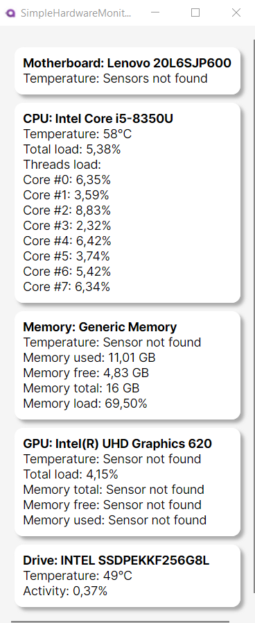

# Simple Hardware Monitor
Example project - desktop application that conveniently displays all basic hardware information on single page. Supports Windows, Linux support not tested.
## Key features
- display name of hardware components
- monitor sensor data in real time
- supports multiple drives and GPUs
- supports only ℃ for temperature display
## Sensors
**Motherboard:**
- Temperature

**CPU:**
- Temperature
- Total load
- Threads load
  
**Memory:**
- Temperature
- Memory used
- Memory free
- Memory total
- Memory load
  
**GPU:**
- Temperature
- Total load
- Memory total
- Memory free
- Memory used
  
**Drives:**
- Temperature
- Activity
  
## Used technology
**Backend:**
- .NET 8
- C#
- LibreHardwareMonitor library

**Frontend:**
- Avalonia UI
- XAML

# Preview images

